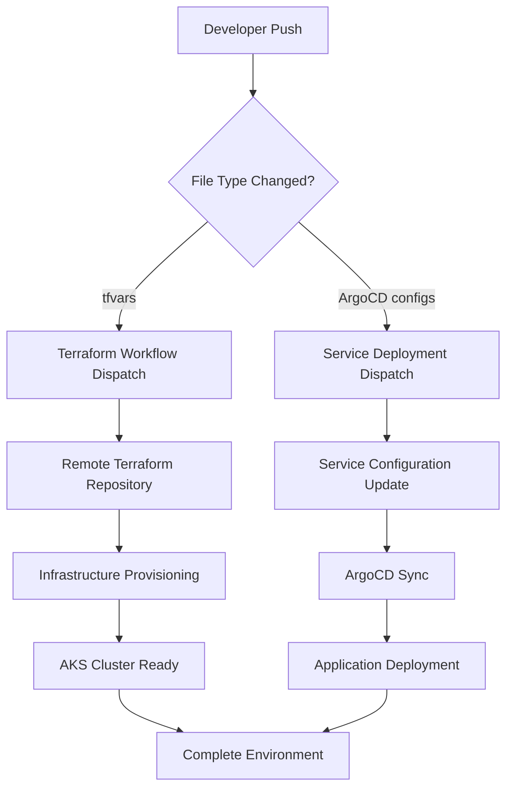

# Azure Terraform Variables Module

This repository serves as the central configuration hub for Azure AKS infrastructure deployments, managing environment-specific Terraform variables, ArgoCD configurations, and Helm chart templates in a GitOps approach. It works in conjunction with the [Azure AKS Terraform Infrastructure Module](link-to-terraform-repo) to provide a complete Infrastructure as Code (IaC) and Configuration as Code (CaC) solution.

## 🎯 Overview

This repository implements a **GitOps-driven configuration management system** that:

- **Separates concerns** between infrastructure code and configuration
- **Automates deployments** through GitHub Actions workflows
- **Manages multiple environments** (dev, staging, prod) declaratively
- **Integrates ArgoCD** for Kubernetes application lifecycle management
- **Provides templated configurations** for dynamic value injection

## 🏗️ Repository Architecture

```
.
├── .github/workflows/           # GitHub Actions for automation
│   ├── dispatch-on-argocd-change.yaml
│   └── dispatch-on-tfvars-change.yml
├── environments/               # Environment-specific Terraform variables
│   ├── dev.tfvars
│   ├── staging.tfvars
│   └── prod.tfvars
├── manifests/
│   ├── argocd-configs/        # ArgoCD configuration files
│   │   ├── applications/      # Application definitions
│   │   ├── projects/          # Project definitions
│   │   ├── repositories/      # Repository configurations
│   │   ├── application.yaml   # Application registry
│   │   ├── project.yaml       # Project registry
│   │   ├── repository.yaml    # Repository registry
│   │   └── meta.json          # Environment enablement
│   └── helm-values/           # Helm chart template files
│       ├── argocd.tftpl
│       ├── keycloak.tftpl
│       ├── monitoring.tftpl
│       └── observability.tftpl
└── README.md
```

## 🔄 GitOps Workflow



## 🚀 Key Features

### **Automated Infrastructure Management**
- **Event-driven deployments** triggered by file changes
- **Multi-environment support** with environment-specific configurations
- **Remote workflow dispatch** to dedicated Terraform CI/CD repository
- **Dynamic template rendering** for Helm charts and configurations

### **GitOps Application Delivery**
- **ArgoCD App-of-Apps pattern** for microservice management
- **Declarative application definitions** in YAML format
- **Automated synchronization** with source repositories
- **Environment-aware application deployment**

### **Configuration Management**
- **Templated Helm values** with variable substitution
- **Environment isolation** through separate configuration files
- **Secret management** integration with Azure Key Vault
- **Dynamic service discovery** and configuration

## 📁 Component Details

### GitHub Actions Workflows

#### `dispatch-on-tfvars-change.yml`
Monitors changes to Terraform variable files and triggers infrastructure updates.

**Triggers:**
- Changes to `environments/*.tfvars` files
- Pull requests and pushes to `cloudops/**` branches

**Behavior:**
- Detects which environment files changed (dev, staging, prod)
- Dispatches events to remote Terraform workflow repository
- Passes environment context and Git metadata

**Key Features:**
```yaml
# Environment detection based on file patterns
files_yaml: |
  dev:
    - environments/dev*.tfvars
    - environments/dev*.tfvars.json
  staging:
    - environments/staging*.tfvars
  prod:
    - environments/prod*.tfvars
```

#### `dispatch-on-argocd-change.yaml`
Monitors ArgoCD configuration changes and triggers application deployments.

**Triggers:**
- Changes to `manifests/argocd-configs/**` files
- Application, project, or repository configuration updates

**Behavior:**
- Identifies changed ArgoCD resource types
- Reads environment enablement from `meta.json`
- Creates matrix strategy for multi-environment deployment

### Environment Configurations

#### Development Environment (`dev.tfvars`)
**Optimized for:**
- Cost efficiency and fast iteration
- Basic security for internal development
- Minimal resource allocation
- Development-friendly configurations

**Key Settings:**
```hcl
# Basic AKS configuration
kubernetes_version = "1.32.4"
node_count         = 1
vm_size           = "Standard_B2s"

# Security - Relaxed for development
private_cluster_enabled = false
enable_private_endpoints = false
enable_firewall = false

# Observability - Essential components only
enable_opensource_grafana = true
enable_loki = true
enable_tempo = true
loki_retention_period = "72h"  # 3 days
```

#### Staging Environment (`staging.tfvars`)
**Optimized for:**
- Production-like testing and validation
- Enhanced security and monitoring
- Moderate resource allocation
- Performance testing scenarios

**Key Settings:**
```hcl
# Production-like AKS configuration
node_count = 2
vm_size = "Standard_D2s_v3"
enable_auto_scaling = true

# Enhanced security
private_cluster_enabled = true
enable_private_endpoints = true
enable_defender = true

# Additional node pools for workload separation
enable_node_pools = true
node_pools = {
  "user-workloads" = {
    vm_size = "Standard_D2s_v3"
    enable_auto_scaling = true
    min_count = 1
    max_count = 3
  }
}
```

### ArgoCD Configuration Structure

#### Applications (`manifests/argocd-configs/applications/`)
Defines individual application deployments following ArgoCD Application CRD format.

**Example Application Structure:**
```yaml
# backend.yaml
metadata:
  name: backend
spec:
  project: genesis
  source:
    repoURL: https://github.com/HARMAN-DTS/Genesis
    path: backend
    targetRevision: HEAD
  destination:
    server: https://kubernetes.default.svc
    namespace: genesis
  syncPolicy:
    automated:
      prune: true
      selfHeal: true
```

**Supported Applications:**
- **ArgoCD** - GitOps controller
- **Keycloak** - Identity and access management
- **Backend Services** - Application backend components
- **Frontend Services** - User interface components
- **PostgreSQL** - Database services
- **Monitoring Stack** - Observability components

#### Projects (`manifests/argocd-configs/projects/`)
Defines ArgoCD projects for application grouping and RBAC.

**Project Categories:**
- **cloudops** - Infrastructure and platform services
- **genesis** - Application-specific services

#### Repositories (`manifests/argocd-configs/repositories/`)
Configures source repositories for ArgoCD synchronization.

**Repository Types:**
- **Helm repositories** (Bitnami, Prometheus Community, etc.)
- **Git repositories** (Application source code)
- **OCI repositories** (Container registries)

### Helm Value Templates

#### Template Files (`manifests/helm-values/*.tftpl`)
Terraform template files that render dynamic Helm values.

**Template Variables:**
```hcl
# Available in all templates
${domain_name}      # Application domain
${app_gateway_ip}   # Application Gateway IP
```

**Template Examples:**

**ArgoCD Configuration:**
```yaml
# argocd.tftpl
global:
  domain: ${domain_name}
server:
  ingress:
    enabled: true
    hosts:
      - host: ${domain_name}
        paths:
          - path: /
```

**Keycloak Configuration:**
```yaml
# keycloak.tftpl
httpRelativePath: "/auth"
extraEnv: |
  - name: KC_HOSTNAME
    value: "${domain_name}"
```

## 🛠️ Usage Guide

### Prerequisites

**Required GitHub Secrets:**
| Secret | Scope | Description |
|--------|-------|-------------|
| `GH_PAT` | Repository | GitHub Personal Access Token with workflow permissions |

**Required GitHub Variables:**
| Variable | Scope | Description |
|----------|-------|-------------|
| `TF_WORKFLOW_REPO` | Repository | Remote Terraform workflow repository (`owner/repo`) |
| `TF_LIFECYCLE` | Environment | Terraform operation (`init`, `plan`, `apply`, `plan-apply`) |

### Environment Setup

1. **Configure Repository Variables:**
```bash
# Set the remote Terraform workflow repository
gh variable set TF_WORKFLOW_REPO --value "your-org/terraform-workflows"
```

2. **Configure Environment Variables:**
```bash
# For each environment (dev, staging, prod)
gh variable set TF_LIFECYCLE --env dev --value "plan-apply"
gh variable set TF_LIFECYCLE --env staging --value "plan"
gh variable set TF_LIFECYCLE --env prod --value "plan"
```

3. **Configure GitHub Secrets:**
```bash
# Personal Access Token for cross-repository dispatch
gh secret set GH_PAT --value "ghp_your_token_here"
```

### Making Configuration Changes

#### Infrastructure Changes
1. **Modify Environment Configuration:**
```bash
# Edit environment-specific variables
vim environments/dev.tfvars
```

2. **Commit and Push:**
```bash
git add environments/dev.tfvars
git commit -m "feat: enable observability stack in dev"
git push origin cloudops/feature-branch
```

3. **Automatic Processing:**
- GitHub Actions detects tfvars changes
- Dispatches event to Terraform workflow repository
- Infrastructure provisioning begins automatically

#### Application Changes
1. **Update ArgoCD Configuration:**
```bash
# Enable new application
vim manifests/argocd-configs/application.yaml

# Configure application details
vim manifests/argocd-configs/applications/new-app.yaml
```

2. **Commit and Deploy:**
```bash
git add manifests/argocd-configs/
git commit -m "feat: add new microservice deployment"
git push origin cloudops/feature-branch
```

3. **ArgoCD Synchronization:**
- Configuration changes trigger ArgoCD sync
- Applications deployed according to specifications

### Environment Management

#### Enable/Disable Environments
```json
// manifests/argocd-configs/meta.json
{ 
  "environments": { 
    "dev": { "enabled": "true" }, 
    "staging": { "enabled": "true" }, 
    "prod": { "enabled": "false" }
  } 
}
```

#### Environment-Specific Configurations
Each environment supports different configuration profiles:

**Development:**
- Single node cluster
- Basic monitoring
- Minimal security
- Fast iteration

**Staging:**
- Multi-node cluster
- Enhanced monitoring
- Production-like security
- Performance testing

**Production:**
- High-availability cluster
- Full observability stack
- Maximum security
- Performance optimization

## 🔐 Security & Best Practices

### Secret Management
- **Azure Key Vault integration** for sensitive configurations
- **GitHub Secrets** for automation credentials
- **Repository-specific secrets** for environment isolation

### Access Control
- **Branch protection** on main branches
- **Environment protection rules** for production deployments
- **ArgoCD RBAC** for application-level access control

### Configuration Validation
- **Pre-commit hooks** for configuration validation
- **GitHub Actions checks** for syntax validation
- **ArgoCD health checks** for deployment validation

## 📊 Monitoring & Observability

### Configuration Monitoring
- **GitHub Actions workflow status**
- **ArgoCD application health**
- **Terraform state consistency**

### Application Monitoring
- **Grafana dashboards** for infrastructure metrics
- **Prometheus alerting** for system health
- **Loki logging** for application logs
- **Tempo tracing** for distributed systems

## 🔧 Troubleshooting

### Common Issues

#### Workflow Dispatch Failures
```bash
# Check GitHub Actions logs
gh run list --workflow="Dispatch on tfvars value changes"

# Verify repository variables
gh variable list
```

#### ArgoCD Sync Issues
```bash
# Check ArgoCD application status
kubectl get applications -n argocd

# Review ArgoCD controller logs
kubectl logs -n argocd deployment/argocd-application-controller
```

#### Template Rendering Problems
```bash
# Validate Terraform templates locally
terraform console
> templatefile("manifests/helm-values/argocd.tftpl", {
    domain_name = "example.com"
  })
```

### Debug Commands
```bash
# Check environment file changes
git diff HEAD~1 environments/

# Validate ArgoCD configurations
argocd app get <app-name>

# Test Helm template rendering
helm template <release-name> <chart> -f <values-file>
```

## 🤝 Contributing

### Development Workflow
1. **Create feature branch** from `main`
2. **Make configuration changes** following conventions
3. **Test in development environment** first
4. **Create pull request** with detailed description
5. **Review and approval** by platform team
6. **Merge to main** triggers production deployment

### Configuration Standards
- **Use consistent naming** across environments
- **Document configuration changes** in commit messages
- **Follow YAML formatting** standards
- **Validate configurations** before committing

### Code Review Guidelines
- **Review security implications** of configuration changes
- **Verify environment-specific** settings
- **Check resource allocation** appropriateness
- **Validate template syntax** and variables

## 🔗 Integration Points

### Terraform Infrastructure Module
- **Consumes tfvars files** for infrastructure provisioning
- **Provides outputs** for application configuration
- **Manages Azure resources** and AKS cluster

### ArgoCD Applications
- **Syncs with application repositories**
- **Applies Kubernetes manifests**
- **Manages application lifecycle**

### Helm Chart Repositories
- **Sources charts** from public repositories
- **Applies custom values** from templates
- **Manages release lifecycle**

## 📚 Additional Resources

### Documentation
- [ArgoCD Documentation](https://argo-cd.readthedocs.io/)
- [Terraform Documentation](https://developer.hashicorp.com/terraform/docs)
- [Azure AKS Documentation](https://docs.microsoft.com/en-us/azure/aks/)
- [Helm Documentation](https://helm.sh/docs/)

### Related Repositories
- **Terraform Configurations Repository** - Core AKS infrastructure
- **Terraform Workflows Repository** - CI/CD automation

## 📄 License

This project is licensed under the MIT License - see the [LICENSE](LICENSE) file for details.

---

**Note**: This repository requires proper setup of the companion Terraform infrastructure module and remote workflow repository. Ensure all prerequisites are met before making configuration changes.
